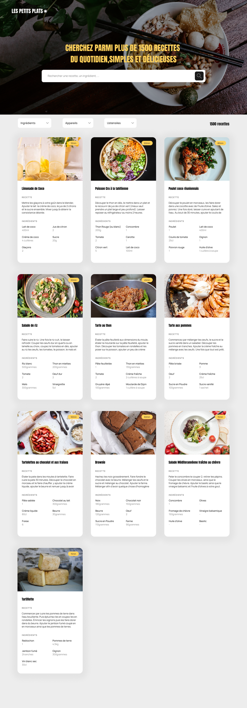

# LesPetitsPlats : une plateforme interactive de recettes de cuisine

[ Read this file in English](./README.md)

## Description

Les Petits Plats est une plateforme interactive de recettes de cuisine. Le projet a évolué d'une maison d'édition de livres de cuisine à un site web riche et interactif, où les utilisateurs peuvent facilement trouver, filtrer, et explorer des recettes grâce à un moteur de recherche avancé et une interface utilisateur optimisée.

## Fonctionnalités

-   **Recherche dynamique :** Les utilisateurs peuvent rechercher des recettes par mots-clés, ingrédients, ustensiles, et appareils.

-   **Filtrage avancé :** Permet une recherche détaillée grâce à des filtres spécifiques intégrés dans l'interface.

-   **Interface conviviale :** Conçue pour une expérience utilisateur fluide, avec des réponses rapides et des interactions intuitives.

## Technologies Utilisées

## Design

Le design de _LesPetitsPlats_ a été pensé pour offrir une expérience utilisateur intuitive et esthétiquement agréable, tout en mettant en avant les œuvres des recettes.

### Captures d'écran

Voici quelques captures d'écran qui illustrent le résultat final du site :

Ces images donnent un aperçu du design interactif et réactif du site.

## Installation

Suivez ces étapes pour installer et exécuter le projet _LesPetitsPlats_ sur votre machine locale pour le développement et les tests.

### Prérequis

Assurez-vous d'avoir Node.js installé sur votre machine. Si ce n'est pas le cas, vous pouvez le télécharger et l'installer depuis [Node.js official website](https://nodejs.org/).

### Clonage du dépôt

Ouvrez votre terminal et tapez la commande suivante pour cloner le dépôt GitHub :
`git clone https://github.com/IbrahimAlsabr/LesPetitsPlats.git`

### Installation des dépendances

Changez de répertoire pour accéder au dossier du projet cloné et installez les dépendances nécessaires :

`cd LesPetitsPlats`

`npm install`

### Lancement de l'application

Ouvrez `index.html` dans votre navigateur

## Auteur

### Ibrahim Alsabr

  
