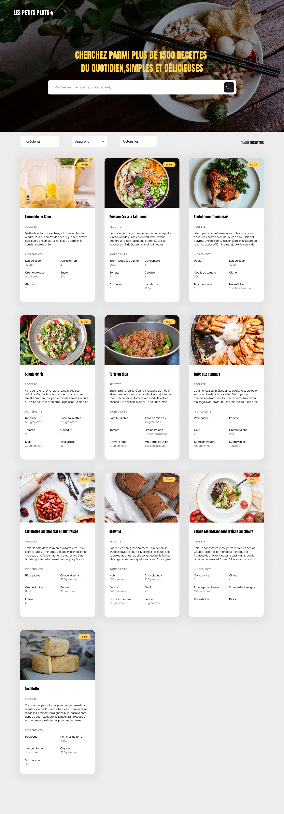

# LesPetitsPlats : An Interactive Cooking Recipe Platform

[ Lire ce fichier en français](./README-FR.md)

## Description

Les Petits Plats is an interactive cooking recipe platform. The project has evolved from a cookbook publishing house to a rich and interactive website where users can easily find, filter, and explore recipes thanks to an advanced search engine and an optimized user interface.

## Features

-   **Dynamic Search :** Users can search for recipes by keywords, ingredients, utensils, and appliances.

-   **Advanced Filtering :** Allows for detailed searching through specific filters integrated into the interface.

-   **User-Friendly Interface :** Designed for a smooth user experience with quick responses and intuitive interactions.

## Technologies Used

## Design

The design of _LesPetitsPlats_ was crafted to provide an intuitive and aesthetically pleasing user experience, while highlighting the culinary creations of the recipes.

### Screenshots

Here are some screenshots illustrating the final outcome of the site:

These images give a preview of the interactive and responsive design of the site.

## Installation

Follow these steps to install and run the _LesPetitsPlats_ project on your local machine for development and testing.

### Prerequisites

Make sure you have Node.js installed on your machine. If not, you can download and install it from the [Node.js official website](https://nodejs.org/).

### Cloning the Repository

Open your terminal and type the following command to clone the GitHub repository:
`git clone https://github.com/IbrahimAlsabr/LesPetitsPlats.git`

### Installing Dependencies

Change the directory to access the cloned project folder and install the necessary dependencies:

`cd LesPetitsPlats`

`npm install`

### Launching the Application

Ouvrez `index.html` dans votre navigateur

## Author
### Ibrahim Alsabr
  
